<sub>🌐 [English](README.md) · **Español**</sub>

# Autonomía del RB1 en almacén: Nav2 + árboles de comportamiento (ROS 2 Humble)

Misión autónoma de manejo de estantes para el **robot móvil RB1** en un almacén, construida sobre
**ROS 2 Humble**, **Nav2** y **BehaviorTree.CPP**. Probada en simulación con Gazebo y **en el robot real**.

▶️ **Demo en el robot real:** [video en YouTube](https://www.youtube.com/watch?v=rZ5ojMnCDvw)


## Qué hace el robot

Un comportamiento complejo se arma a partir de otros más simples con árboles de comportamiento:

1. **Encuentra la estación de carga y se localiza.** Detecta la estación con el LiDAR y usa su posición conocida para inicializar la localización en el mapa.
2. **Busca un estante** en cualquier parte del almacén, recorriendo una lista de puntos de Nav2.
3. **Se acerca al estante**, entra debajo y usa el elevador para **levantarlo**.
4. **Lo lleva y lo deja** en la ubicación indicada.

**Técnicas principales:** detección de objetos por la intensidad del láser (cintas reflectivas), publicación de
frames con TF2 para el acoplamiento, control proporcional para la aproximación, clientes de `NavigateToPose` de
Nav2, cambio dinámico del footprint al cargar el estante y nodos de acción y condición propios para BehaviorTree.CPP.

## 1. Instalación

### 1.1 Preparar el workspace
```bash
mkdir -p ~/rb1_ws/src
cd ~/rb1_ws/src
git clone https://github.com/morg1207/rb1_autonomy.git
```

### 1.2 Instalar dependencias y compilar
```bash
source /opt/ros/$ROS_DISTRO/setup.bash
cd ~/rb1_ws
vcs import src < ~/rb1_ws/src/rb1_autonomy/rb1_simulation.repos
sudo apt update
rosdep init
rosdep update --rosdistro $ROS_DISTRO
rosdep install -i --from-path src --rosdistro $ROS_DISTRO -y
colcon build --symlink-install
```

## 2. Arquitectura

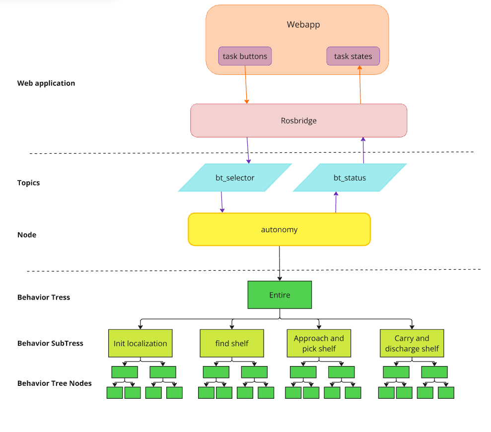

### 2.1 Servidores

#### 2.1.1 Servidor Find Object
Detecta objetos a partir de la **intensidad de las lecturas del láser**, buscando cintas reflectivas. El objeto
debe tener dos patas, cada una con un trozo de cinta. Hoy detecta dos tipos de objeto: `shelf` (estante) y
`station` (estación de carga).

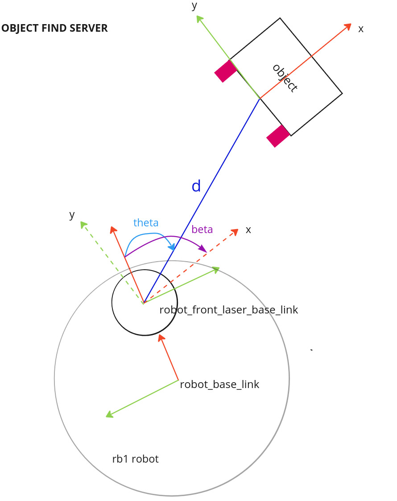

Devuelve un `geometry_msgs::msg::Pose` donde `x` = d, `y` = θ y `z` = β.

**Parámetros**
- `use_sim_time`: `true` en simulación, `false` en el robot real.
- `limit_intensity_laser_detect`: intensidad mínima para detectar una cinta reflectiva.
- `limit_min_detection_distance_legs_shelf` / `limit_max_detection_distance_legs_shelf`: rango de separación entre patas que identifica un estante.
- `limit_min_detection_distance_legs_charge_station` / `limit_max_detection_distance_legs_charge_station`: rango de separación entre patas que identifica la estación de carga (**solo robot real**; la simulación no tiene estación).

#### 2.1.2 Servidor Approach Shelf
Controla la entrada y la salida del estante usando frames de TF. Hay tres tipos de control (ver la imagen);
solo se usa el proporcional.

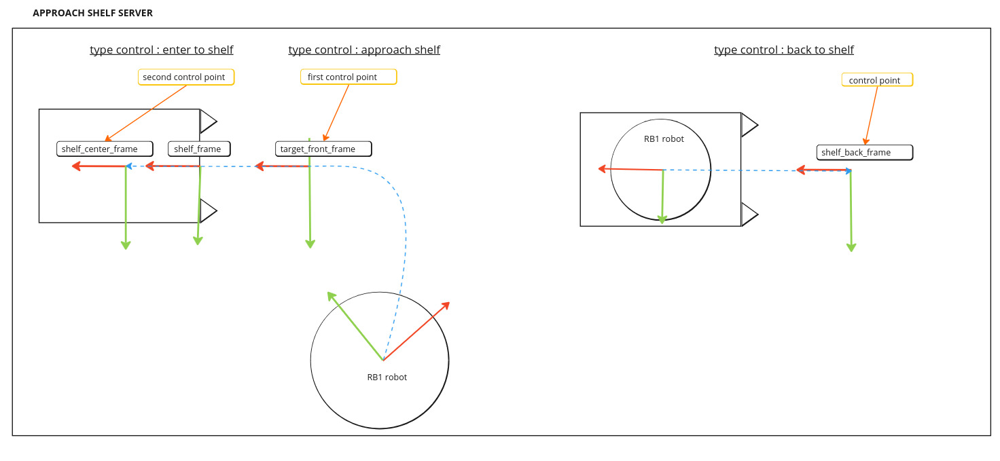

**Parámetros**
- `use_sim_time`: `true` en simulación, `false` en el robot real.
- `vel_min_linear_x`, `vel_max_linear_x`: límites de velocidad lineal en x.
- `vel_min_angular_z`, `vel_max_angular_z`: límites de velocidad angular en z.
- `kp_lineal`, `kp_angular`: ganancias proporcionales de velocidad lineal y angular.
- `distance_approach_target_error`: error de distancia aceptable al acercarse al objetivo.
- `distance_approach_target_error_back`: error de distancia aceptable al acercarse en reversa.
- `angle_approach_target_error`: error angular aceptable al acercarse al objetivo.
- `laser_min_range`: rango mínimo del láser para detectar objetos.
- `distance_for_back_frame_publish`: distancia a partir de la cual se publica el frame trasero.

#### 2.1.3 Servidor Init Localization (solo robot real)
Calcula la pose del robot en el mapa a partir de un objeto fijo de posición conocida, la estación de carga, y
la publica en `/initial_pose`.

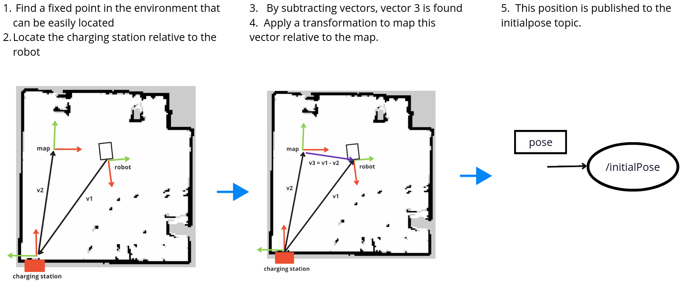

**Parámetros**
- `use_sim_time`: `true` en simulación, `false` en el robot real.
- `pose_map_to_station_charge_x`, `pose_map_to_station_charge_y`, `pose_map_to_station_charge_yaw`: pose del mapa respecto a la estación de carga.

### 2.2 Árbol de comportamiento

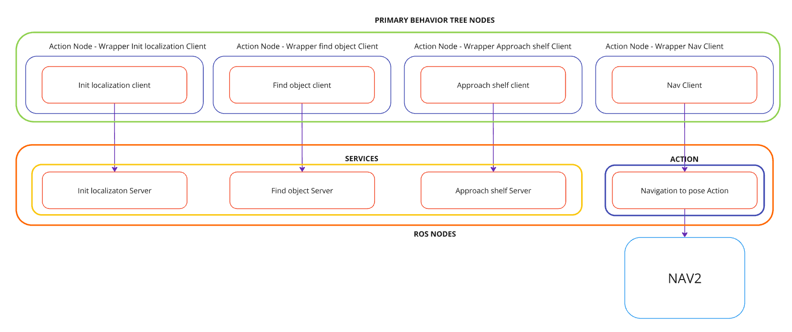

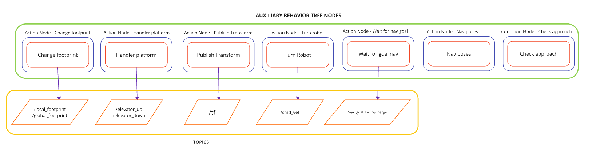

#### 2.2.1 Nodos de acción

| Nodo | Descripción |
|---|---|
| **ClientFindObject** | Cliente del servidor Find Object: envía la búsqueda y devuelve el resultado. |
| **ClientApproachShelf** | Cliente del servidor Approach Shelf: lleva el robot hasta el estante detectado. |
| **ClientInitLocalization** | Cliente del servidor Init Localization: fija la pose inicial a partir de la estación de carga. |
| **ClientNav** | Cliente de la acción `NavigateToPose` de Nav2. |
| **PublishTransform** | Publica la transformación entre frames de referencia. |
| **HandlerPlatform** | Sube o baja la plataforma del elevador para cargar o descargar el estante. |
| **ChangeFootprint** | Cambia el footprint del robot (por ejemplo, al cargar un estante). |
| **TurnRobot** | Gira el robot sobre su eje hacia un objetivo o para ajustar su pose. |
| **NavPoses** | Envía a Nav2 una lista de puntos, definidos en un YAML, para recorrer el almacén buscando el estante. |
| **WaitForGoalNav** | Espera a que el robot llegue a su objetivo de navegación; se usa para esperar la posición de descarga. |

#### 2.2.2 Nodos de condición

| Nodo | Descripción |
|---|---|
| **CheckApproach** | Verifica si el control de aproximación terminó mientras el servidor Approach Shelf está activo. |

#### 2.2.3 Árboles de comportamiento

1. **Encontrar la estación e inicializar la localización** (solo robot real).

   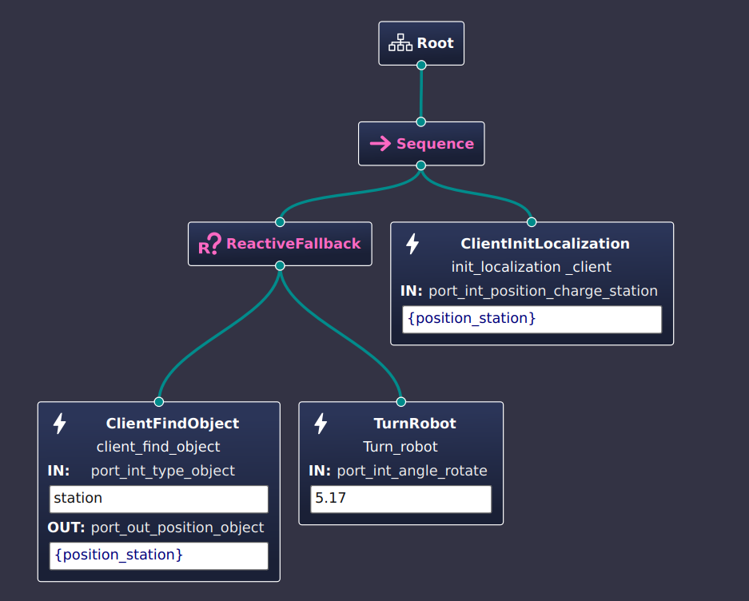

2. **Buscar el estante:** envía puntos de navegación mientras el servidor Find Object busca el estante.

   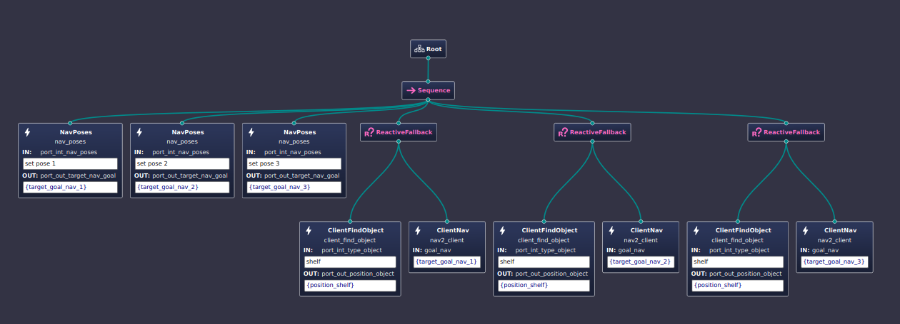

3. **Acercarse y levantar el estante:** guía al robot debajo del estante y lo posiciona bien antes de levantarlo.

   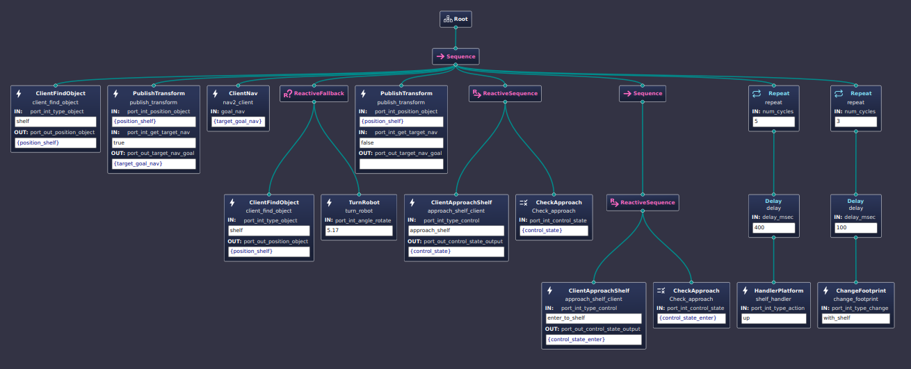

4. **Llevar y descargar el estante:** espera a que el robot llegue a la pose de descarga, baja la plataforma y sale de debajo del estante.

   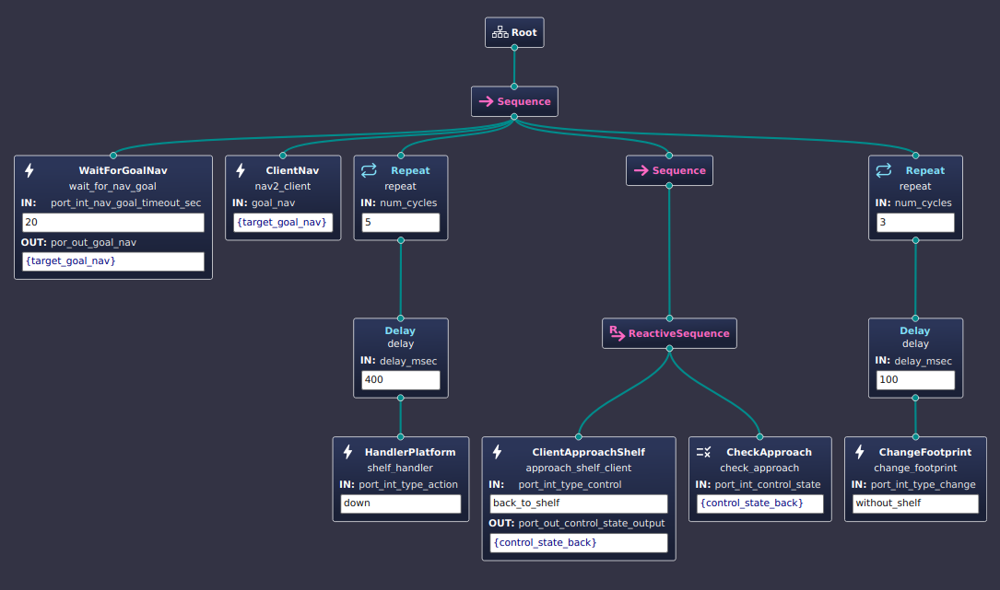

## 3. Ejecución

Cada terminal empieza con:
```bash
cd ~/rb1_ws
source /opt/ros/$ROS_DISTRO/setup.bash
source install/setup.bash
```

### 3.1 Simulación

| Terminal | Comando |
|---|---|
| 1 — Gazebo | `ros2 launch the_construct_office_gazebo warehouse_rb1_rviz.launch.xml` |
| 2 — Nav2 | `ros2 launch path_planner_server navigation.launch.py type_simulation:=sim_robot use_sim_time:=True map_file:=warehouse_map_sim_edit.yaml` |
| 3 — Servidores | `ros2 launch rb1_autonomy servers.launch.py robot_mode:=sim_robot` |
| 4 — Autonomía | `ros2 launch rb1_autonomy autonomy.launch.py robot_mode:=sim_robot` |

#### Elegir un árbol de comportamiento (terminal 5)

**Buscar el estante**
```bash
ros2 topic pub -t 3 /bt_selector std_msgs/msg/String "{data: 'find_shelf'}"
```
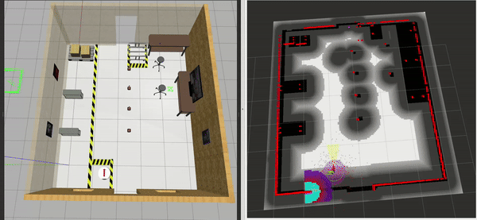

**Acercarse y levantar el estante**
```bash
ros2 topic pub -t 3 /bt_selector std_msgs/msg/String "{data: 'approach_and_pick_shelf'}"
```

**Llevar y descargar el estante**


> **Limitación conocida:** al levantar el estante, el robot suele quedar muy cerca de otros objetos y, con el
> footprint agrandado, queda en colisión. Antes de enviar un nuevo objetivo hay que sacarlo a mano, en reversa:
> ```bash
> ros2 run teleop_twist_keyboard teleop_twist_keyboard
> ```

Después se lanza el árbol y se publica la pose de descarga:
```bash
ros2 topic pub -t 3 /bt_selector std_msgs/msg/String "{data: 'carry_and_discharge_shelf'}"
ros2 topic pub -t 3 /nav_goal_for_discharge geometry_msgs/msg/Pose "{position: {x: 0.53, y: 0.62, z: 2.0}, orientation: {x: 0.0, y: 0.0, z: 0.7, w: 0.71}}"
```

**Misión completa**

Coloca el estante donde no provoque colisiones. Cuando la terminal 4 muestre `waiting for nav goal` (el
estante ya está cargado), publica la pose de descarga:
```bash
ros2 topic pub -t 3 /bt_selector std_msgs/msg/String "{data: 'entire_simulation'}"
ros2 topic pub -t 3 /nav_goal_for_discharge geometry_msgs/msg/Pose "{position: {x: 4.56, y: 0.0, z: 0.58}, orientation: {x: 0.0, y: 0.0, z: 0.68, w: 0.72}}"
```

### 3.2 Robot real

| Terminal | Comando |
|---|---|
| 1 — Nav2 | `ros2 launch path_planner_server navigation.launch.py type_simulation:=real_robot use_sim_time:=False map_file:=warehouse_map_real.yaml` |
| 2 — Servidores | `ros2 launch rb1_autonomy servers.launch.py robot_mode:=real_robot` |
| 3 — Autonomía | `ros2 launch rb1_autonomy autonomy.launch.py robot_mode:=real_robot` |

▶️ [Video de la prueba en el robot real](https://www.youtube.com/watch?v=rZ5ojMnCDvw)

## Notas

Este repositorio busca el estante enviando puntos de patrullaje. La versión del video usa otro método: detecta
las patas del estante **agrupando (clustering) las lecturas del láser**. Sigo mejorando y documentando el código
y corrigiendo algunos errores de ese enfoque.

## Agradecimientos

A [The Construct](https://www.theconstruct.ai/), por la simulación del RB1 y la formación detrás de este
proyecto, y a [BehaviorTree.ROS2](https://github.com/BehaviorTree/BehaviorTree.ROS2), por los wrappers de ROS 2
para árboles de comportamiento.
