## PROJECT ABOUT AUTONOMOUS NAVIGATION, BEHAVIOR TREES WITH RB1 ROBOT
This project is about topics like, autonomous navigation, behavior tree and ros2 concepts using rb1 robot in a warehouse environment, this project was tested on humble ros2.

I would like to thank the provided simulation build and behavior_tree_ros2 package for a wrapper of ros2 concepts for BT.

You can find the implementation and testing on the real robot in the following [video](https://www.youtube.com/watch?v=rZ5ojMnCDvw)

I hope this project can contribute to the ros2 community.


## 1. Configuración

### 1.1 Prepare environment
```bash
mkdir -p ~/rb1_ws/src
cd ~/rb1_ws/src
git clone https://github.com/morg1207/rb1_autonomy.git


```
### 1.2 Install dependencies and build

```bash
source /opt/ros/$ROS_DISTRO/setup.bash
cd ~/rb1_ws
vcs import src < ~/rb1_ws/src/rb1_autonomy/rb1_simulation.repos
sudo apt update
rosdep init
rosdep update --rosdistro $ROS_DISTRO
rosdep install -i --from-path src --rosdistro $ROS_DISTRO -y
colcon build --symlink-install
```
## 2. Project Descriptiom
### Architecture

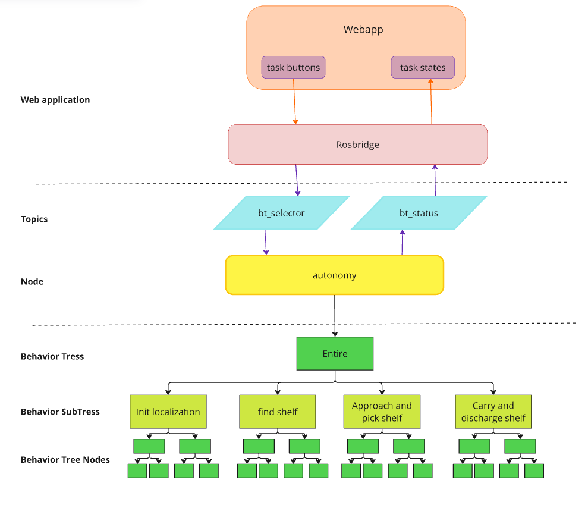  

### 2.1 Servers
#### 2.1.1 Find Object Server
This server searches for an object by detecting reflective tapes through the intensity values read by the laser. The object to be detected must have two legs, each with a piece of tape attached.
Currently this server can detect two objects type, `shelf` and `and station`.

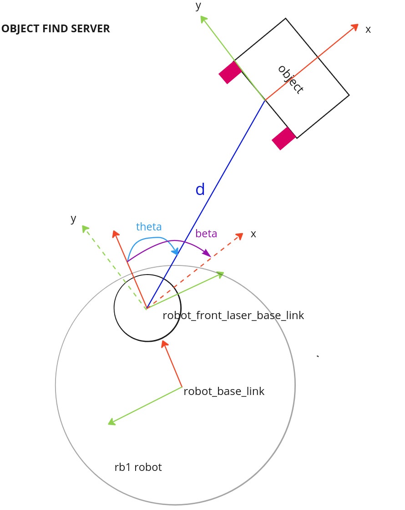  

Aquí tienes la corrección en inglés:

"This server returns a `geometry_msgs::msg::Pose` where:
- `x` = d
- `y` = theta
- `z` = beta."

#### Parameters

- `use_sim_time`:  
  Use `true` for simulation and `false` for the real robot.

- `limit_intensity_laser_detect`:  
  Minimum intensity range required to detect reflective tapes.

- `limit_min_detection_distance_legs_shelf`:  
  Minimum separation distance between legs to identify an object as a shelf.

- `limit_max_detection_distance_legs_shelf`:  
  Maximum separation distance between legs to identify an object as a shelf.

- **Only for the real robot (simulation don't have charge station)**:
  - `limit_min_detection_distance_legs_charge_station`:  
    Minimum separation distance between legs to identify an object as a charging station.
    
  - `limit_max_detection_distance_legs_charge_station`:  
    Maximum separation distance between legs to identify an object as a charging station.

#### 2.1.2 Approach Shelf Server
This server controls the approach to and exit from the shelf using frames. There are three types of control, as shown in the image below, with only proportional control being used.

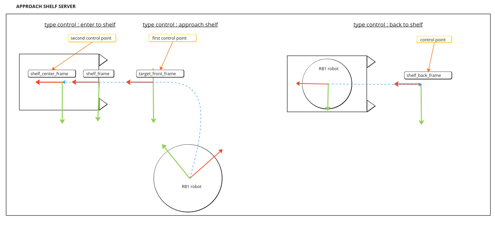  

#### Parameters

- `use_sim_time`:  
  Use `true` for simulation and `false` for the real robot.

- `vel_min_linear_x`:  
  Minimum linear velocity in the x direction.

- `vel_min_angular_z`:  
  Minimum angular velocity in the z direction.

- `vel_max_linear_x`:  
  Maximum linear velocity in the x direction.

- `vel_max_angular_z`:  
  Maximum angular velocity in the z direction.

- `kp_angular`:  
  Proportional control gain for angular velocity.

- `kp_lineal`:  
  Proportional control gain for linear velocity.

- `distance_approach_target_error_back`:  
  Acceptable distance error when reversing to approach the target.

- `distance_approach_target_error`:  
  Acceptable distance error when approaching the target.

- `angle_approach_target_error`:  
  Acceptable angular error when approaching the target.

- `laser_min_range`:  
  Minimum range of the laser sensor to detect objects.

- `distance_for_back_frame_publish`:  
  Distance threshold for publishing the back frame.

#### 2.1.2 Init Localization Server(only for real robot)
This server determines the robot's location relative to the map by using the position of a static object, in this case, the charging station, whose location is known. Finally, this position is published on /initial_pose. The steps are as shown in the image below.

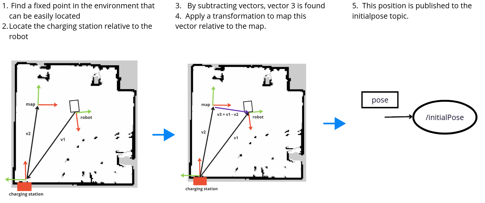  

#### Parameters

- `use_sim_time`:  
  Use `true` for simulation and `false` for the real robot.

- `pose_map_to_station_charge_x`:  
  Position of the map relative to the charging station along the x-axis.

- `pose_map_to_station_charge_y`:  
  Position of the map relative to the charging station along the y-axis.

- `pose_map_to_station_charge_yaw`:  
  Orientation of the map relative to the charging station (yaw angle).

### 2.2 Behavior tree
### Architecture BT

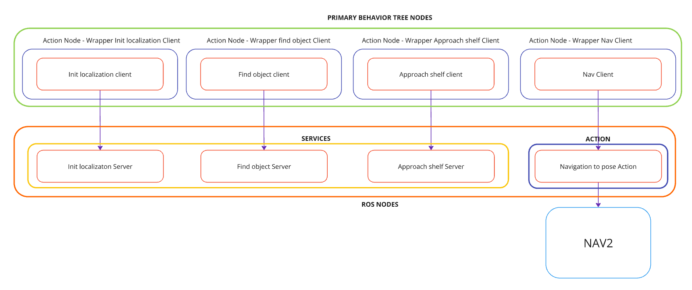 

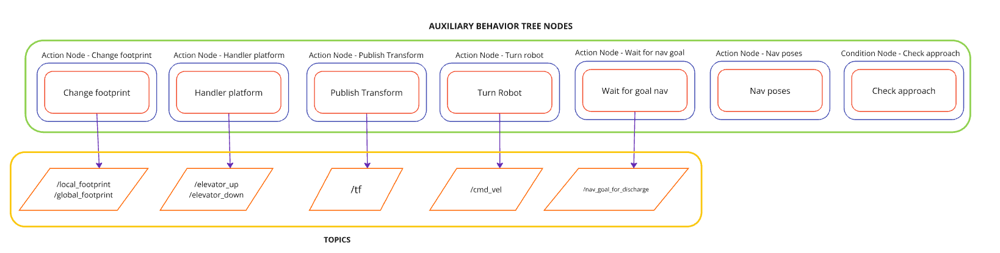 

### 2.2.1 Action Node of the Behavior Tree

Here is the list with the names of your action nodes for the behavior tree, formatted and with descriptions in English:

1. **ClientFindObject**  
   **Description**: This action node initiates the process of searching for an object in the environment using the `server find object`. It acts as a client wrapper around the `server find object`, sending requests to the server and receiving the results.

2. **ClientApproachShelf**  
   **Description**: This action node controls the robot's movement to approach a detected shelf using `server approach shelf`. It acts as a client wrapper around the `server approach shelf`, sending requests to the server and receiving the results.

3. **ClientInitLocalization**  
   **Description**: This action node initializes the robot's localization process on the map, using the position of a known static object, such as a charging station, to determine the robot's starting location using `server init localization`. It acts as a client wrapper around the `server init localization`, sending requests to the server and receiving the results.

4. **ClientNav**  
   **Description**: This action node serves as a client wrapper for the Nav2 navigation system using `navigate to pose` action. It sends navigation goals to the Nav2

5. **PublishTransform**  
   **Description**: This action node publishes the transformation between different reference frames.

6. **HandlerPlatform**  
   **Description**: This action node handles the robot's interactions with the platform it is on, such as loading or unloading objects.

7. **ChangeFootprint**  
   **Description**: This action node allows the robot to change its "footprint".

8. **TurnRobot**  
   **Description**: This action node controls the robot's rotation, allowing it to turn around its axis to change its orientation, either towards a target or to adjust its position in a dynamic environment.

9. **NavPoses**  
   **Description**: This action node sends a set of predefined positions, specified through a YAML file, to the Nav2 client for patrolling the warehouse in search of the shelf.

10. **WaitForGoalNav**  
    **Description**: This action node waits until the robot reaches its navigation goal, constantly checking its status and ensuring it has arrived at the desired position before proceeding. It uses a subscription to receive navigation position updates, specifically for waiting until the robot reaches the carry position for unloading the shelf.

### 2.2.2 Condition Node of the Behavior Tree
1. **CheckApproach**  
   **Description**: This is a condition node used to check the completion status of the control when the server approach shelf is active

### 2.2.3 Behavior Trees
1. **Find station and init localization(only in real robot)**  
   **Description**: This behavior tree is responsible for the robot finding the station and initializing its localization.

   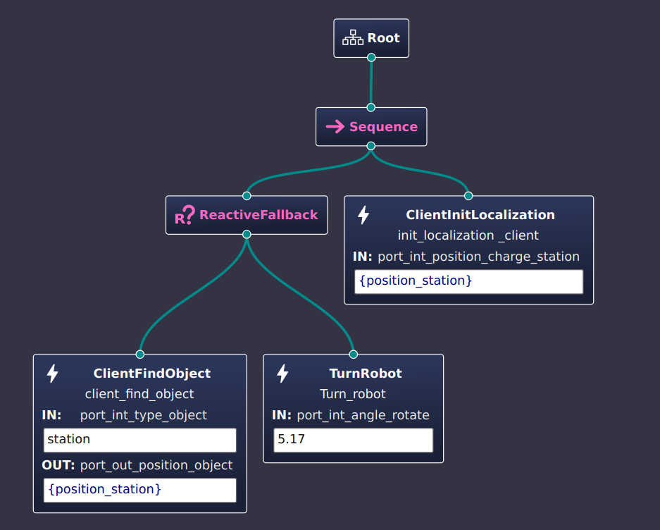 

2. **Find shelf**  
   **Description**: This behavior tree sends different navigation positions while the robot is searching for the shelf using the find object server. 

   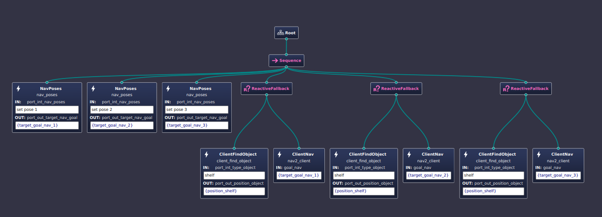 

3. **Approach and pick shelf**  
   **Description**: This behavior tree controls the robot’s approach to the shelf, guiding it to insert itself close enough to the shelf for pick-up. It ensures that the robot positions itself correctly before executing the pick-up action

   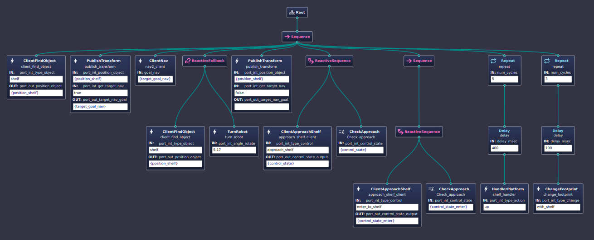 

4. **Carry and discharge shelf**  
   **Description**: This behavior tree waits for the robot to reach the discharge position. Once there, it lowers the platform and disengages the shelf by driving out from underneath it.

    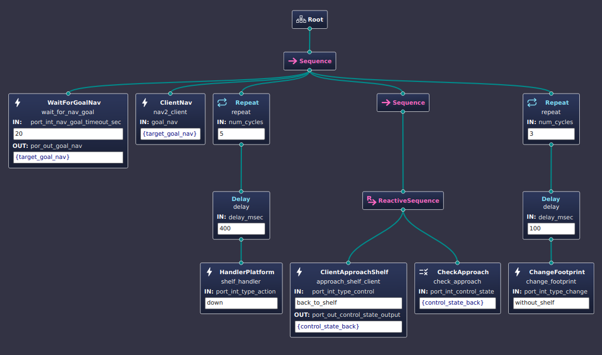 

## 3. Launch project
### 3.1 Sim robot
#### 3.1.1 Launch simulation
Terminal 1
```bash
cd rb1_ws
source /opt/ros/$ROS_DISTRO/setup,bash
source install/setup.bash
ros2 launch the_construct_office_gazebo warehouse_rb1_rviz.launch.xml
```
#### 3.1.2 Launch Nav2
Terminal 2
```bash
cd rb1_ws
source /opt/ros/$ROS_DISTRO/setup,bash
source install/setup.bash
ros2 launch path_planner_server navigation.launch.py type_simulation:=sim_robot use_sim_time:=True map_file:=warehouse_map_sim_edit.yaml 
```
#### 3.1.3 Launch servers
Terminal 3
```bash
cd rb1_ws
source /opt/ros/$ROS_DISTRO/setup,bash
source install/setup.bash
ros2 launch rb1_autonomy servers.launch.py robot_mode:=sim_robot
```
#### 3.1.4 Launch autonomy
Terminal 4

```bash
cd rb1_ws
source /opt/ros/$ROS_DISTRO/setup,bash
source install/setup.bash
ros2 launch rb1_autonomy autonomy.launch.py robot_mode:=sim_robot
```
#### 3.1.5 Select a behavior tree

1. Execute `find_shelf` behavior tree

Terminal 5
```bash
cd rb1_ws
source /opt/ros/$ROS_DISTRO/setup,bash
source install/setup.bash
ros2 topic pub -t 3 /bt_selector std_msgs/msg/String "{data: 'find_shelf'}" 
```
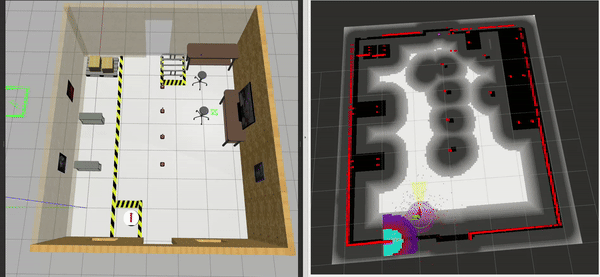

2. Execute `approach_and_pick_shelf` behavior tree

Terminal 5
```bash
cd rb1_ws
source /opt/ros/$ROS_DISTRO/setup,bash
source install/setup.bash
ros2 topic pub -t 3 /bt_selector std_msgs/msg/String "{data: 'approach_and_pick_shelf'}" 
```


3. Execute `carry_and_discharge_shelf` behavior tree

Terminal 5
  As seen in the video, when the robot picks up the shelf, it is often too close to nearby objects and may collide with them. The robot needs to be freed from this collision before sending it a new navigation point,this occurs because the robot's footprint  . You must manually move the robot out of the collision by executing the following steps:


```bash
cd rb1_ws
source /opt/ros/$ROS_DISTRO/setup,bash
source install/setup.bash
ros2 run teleop_twist_keyboard teleop_twist_keyboard 
```
  You can achieve this by manually moving the robot backward, as shown in the video. Once the robot is clear of the collision, you can proceed to execute the next behavior tree.

```bash
cd rb1_ws
source /opt/ros/$ROS_DISTRO/setup,bash
source install/setup.bash
ros2 topic pub -t 3 /bt_selector std_msgs/msg/String "{data: 'carry_and_discharge_shelf'}" 
```
This behavior tree requires you to publish a navigation position.

```bash
cd rb1_ws
source /opt/ros/$ROS_DISTRO/setup,bash
source install/setup.bash
ros2 topic pub -t 3 /nav_goal_for_discharge geometry_msgs/msg/Pose "{position: {x: 0.53, y: 0.62, z: 2.0}, orientation: {x: 0.0, y: 0.0, z: 0.7, w: 0.71}}"

```
5. Execute `entire` behavior tree

You can also run the entire behavior tree. To do this, ensure that the shelf is positioned in a way that avoids complicated situations leading to collisions

You need to publish a position when you see the message "waiting for nav goal" in terminal 4. This will occur once the robot has successfully loaded the shelf.


Terminal 5
```bash
cd rb1_ws
source /opt/ros/$ROS_DISTRO/setup,bash
source install/setup.bash
ros2 topic pub -t 3 /bt_selector std_msgs/msg/String "{data: 'entire_simulation'}" 
```

  This behavior tree requires you to publish a navigation position.
```bash
cd rb1_ws
source /opt/ros/$ROS_DISTRO/setup,bash
source install/setup.bash
ros2 topic pub -t 3 /nav_goal_for_discharge geometry_msgs/msg/Pose "{position: {x: 4.56, y: 0.0, z: 0.58}, orientation: {x: 0.0, y: 0.0, z: 0.68, w: 0.72}}"

```

### 3.2 Real robot

#### 3.2.1 Launch Nav2
Terminal 1
```bash
cd rb1_ws
source /opt/ros/$ROS_DISTRO/setup,bash
source install/setup.bash
ros2 launch path_planner_server navigation.launch.py type_simulation:=real_robot use_sim_time:=False map_file:=warehouse_map_real.yaml 
```
#### 3.2.2 Launch servers
Terminal 2
```bash
cd rb1_ws
source /opt/ros/$ROS_DISTRO/setup,bash
source install/setup.bash
ros2 launch rb1_autonomy servers.launch.py robot_mode:=real_robot
```
#### 3.2.3 Launch autonomy
Terminal 3

```bash
cd rb1_ws
source /opt/ros/$ROS_DISTRO/setup,bash
source install/setup.bash
ros2 launch rb1_autonomy autonomy.launch.py robot_mode:=real_robot
```

You can find the implementation and testing on the real robot in the following [video](https://www.youtube.com/watch?v=rZ5ojMnCDvw)


## Notes

The approach used in this repository focuses on sending navigation waypoints to allow the robot to inspect its surroundings. As shown in the video, a different method is employed to search for the shelf, which involves detecting the legs of the shelf by analyzing the clustering of laser readings. 

I am still working on improving the code, documenting it, and fixing some bugs related to the approach demonstrated in the video.


